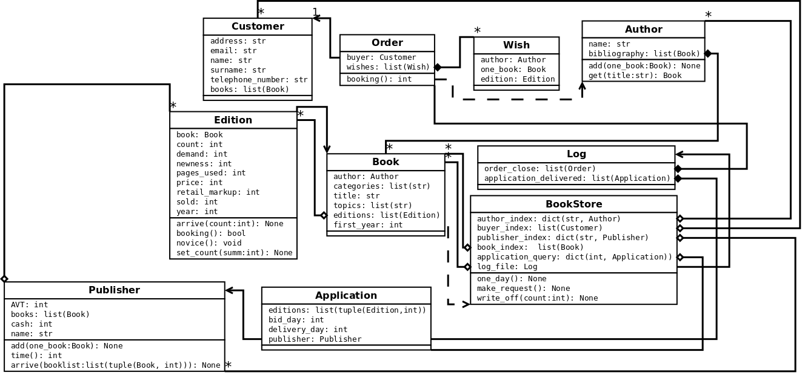
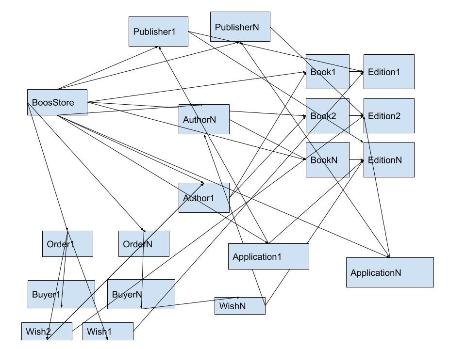
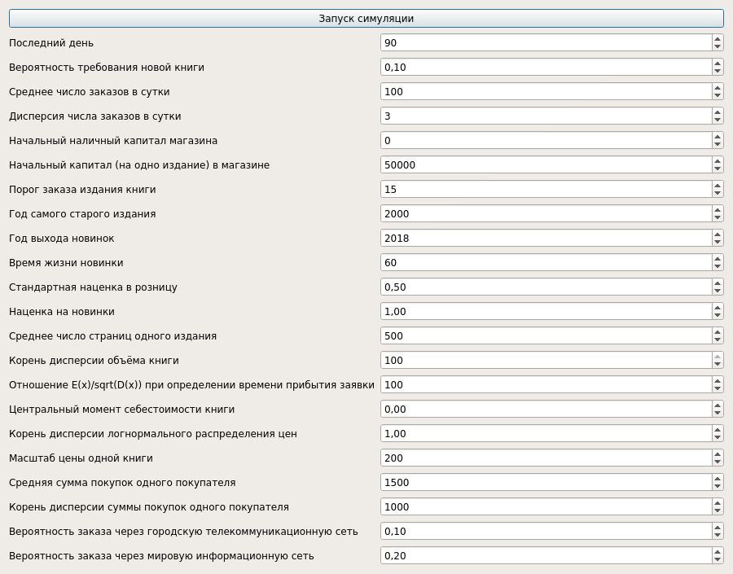
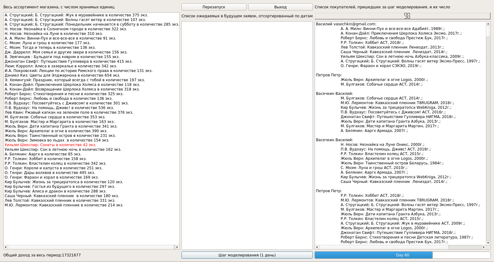
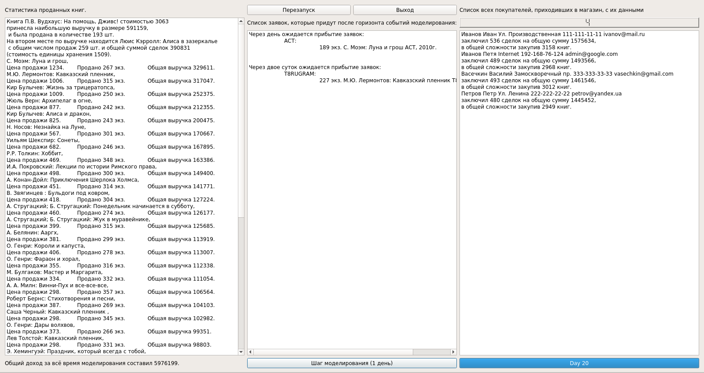

## Система контроля ассортимента книжного магазина

Книжный магазин осуществляет продажу широкого ассортимента книг нескольких издательств. Книги различаются по тематике и категории читателей (детская литература, учебники, научная литература по отдельным областям знаний, литература на иностранных языках, научная фантастика, фэнтези и т.п.).

Компьютерная система контроля ассортимента хранит данные о наличии и количестве экземпляров книг в магазине, при этом для каждой книги хранятся сведения о ее авторе, названии, издательстве, годе издания, количестве страниц, тематике и категории, цене и розничной наценке, рейтинге спроса. Для новых книг розничная наценка на некоторый фиксированный период устанавливается больше обычной. 

В течение каждого рабочего дня система фиксирует заказы на книги (заказы записываются в магазине, а также поступают по телефону и электронной почте). Заказ включает фамилию покупателя, его номер телефона или электронный адрес, а также перечень заказываемых авторов, с книгами и указанием их количества. В заказе может быть указан только автор книги, с требованием новой книги, такая заявка выполняется с последней изданной книгой данного автора. Если требуемая в заказе книга имеется в магазине, то она откладывается для покупателя, и делается соответствующая запись о продаже. В противном случае система отмечает заявку как невыполненную, а книгу как недоставленную. Рейтинг спроса каждой книги рассчитывается по числу ее заказов, по числу фактических продаж, и по общей сумме продаж. 

Система отслеживает фактическое количество экземпляров каждой книги в магазине. Если оно становится меньше определенного порога, то составляется заявка в издетельство на доставку в магазин дополнительных экземпляров этой книги. Более формально, для любой книги, которая не доставляется и количество экземпляров которой в магазине на конец рабочего дня меньше фиксированного параметра моделирования, составляется заявка с указанием числа желаемых экземпляров, в зависимости от рейтинга книги. Заявки выполняются в течение нескольких дней.

Основная функция системы управления ассортиментом - автоматизация обработки заказов на книги и составления заявок в издательства. Для тестирования работы системы смоделирован поток поступающих заказов. Период моделирования переменный, шаг моделирования - один рабочий день.

Поток заказов на книги смоделирован статистически: все составляющие заказа подбираются случайным образом, но при этом новые книги заказываются чаще. Плотность потока заказов зависит от разнообразия ассортимента книг в магазине. Фактический срок доставки книг в магазин (т.е. срок выполнения заявки в издательство) также моделируется с помощью случайной величины.

В параметры моделирования работы книжного магазина включено число \(N\), начальный ассортимент книг в магазине, дипазоны разброса указанных случайных величин, процент обычной розничной наценки и наценки на новые книги. В ходе моделирования доступна информация об ассортименте магазина, о поступивших и обработанных заказах, а также о выполненных заявках в издательство. По окончании моделирования выводится статистическая информация о работе магазина.

### Инструментальные средства

Язык разработки: Python 3

Инструментальная среда:

Jupyter, Spyder

Используемые библиотеки:

collections, random, PyQt5

### Пользовательский интерфейс
Пользовательский интерфейс представляет собой единое окно. В начале сессии предлагается выбрать настройки, которые все имеют некоторое стартовое значение. На экране отображаются краткие характеристики параметров, и панели ввода для их изменения.

После начала моделирования каждый шаг моделируется отдельно, нажатием клавишы Enter либо соответствующей кнопки окна. Основная информация выводится в трёх таблицах, соответствующих книгам, заявкам в издательства и покупателям соответственно.

После окончания моделирования выводится статистическая информация, отсортированная в каждом списке по принесённой магазину прибыли.

